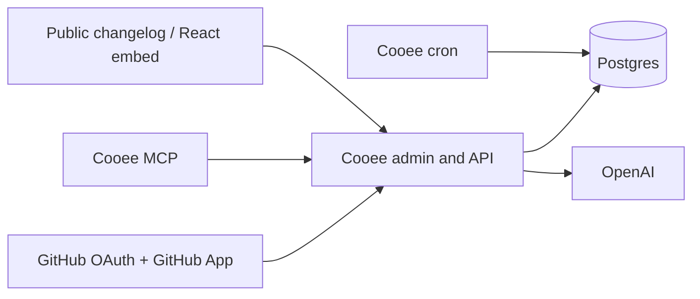

# Cooee

[](https://github.com/cooeehq/cooee/actions/workflows/ci.yml)
[](https://www.npmjs.com/package/@cooeehq/react)
[](LICENSE)

[](https://cooee.sh)

Cooee (`/ˈkuːiː/`) turns merged GitHub pull requests into a privacy-first,
publishable product changelog. It collects PR metadata, drafts customer-facing
updates with AI, holds sensitive or uncertain output for review, and publishes
a hosted changelog, JSON API, React popup, and read-only MCP tool.

[Website](https://cooee.sh) · [Developer docs](https://cooee.sh/docs) ·
[OpenAPI](https://api.cooee.sh/api/public/openapi.json) ·
[`@cooeehq/react`](https://www.npmjs.com/package/@cooeehq/react) ·
[MCP endpoint](https://mcp.cooee.sh/mcp)

## Why Cooee

- Draft updates from merged PR titles, descriptions, labels, repositories, and
  merge times without sending diffs or repository contents to the AI model.
- Review, edit, schedule, publish, merge, regenerate, and delete changelog
  entries from the operator dashboard.
- Fail closed: sensitive labels, secret-like values, low confidence, and invalid
  model output create held drafts instead of public posts.
- Publish responsive public changelogs, absolute-URL JSON feeds, and a complete
  OpenAPI 3.1 contract.
- Embed updates in React 18 or 19 with accessible focus handling, localization,
  CSP nonce support, unread tracking, and light/dark/system themes.
- Retrieve published updates through a read-only MCP service with no drafting,
  publishing, or caller-controlled upstream origin.
- Self-host under the MIT license or use the managed service at
  [cooee.sh](https://cooee.sh).

## Repository

This is a Bun and TypeScript monorepo:

| Path                   | Purpose                                                                                       |
| ---------------------- | --------------------------------------------------------------------------------------------- |
| `apps/admin`           | Self-hosted operator dashboard and public changelog frontend                                  |
| `apps/api`             | Bun API, authentication, GitHub integration, generation, feeds, billing hooks, and migrations |
| `apps/mcp`             | Separate read-only MCP server backed by the public API                                        |
| `packages/shared`      | Feed schemas, privacy filters, scheduling, and shared product contracts                       |
| `packages/embed-react` | Published ESM-only React package, [`@cooeehq/react`](packages/embed-react/README.md)          |

The API can serve the built admin bundle, so the recommended self-hosted setup is
compact:



The managed deployment keeps the private marketing website repository separate
from this open-source codebase and separates the admin UI, API/custom
domain origin, cron, and MCP into independent services. That split is useful for
operations but is not required for self-hosting.

## Local development

Prerequisites: [Bun 1.3](https://bun.sh), PostgreSQL 17 or compatible, a GitHub
OAuth app, a GitHub App, and an OpenAI API key.

```bash
git clone https://github.com/cooeehq/cooee.git
cd cooee
bun install --frozen-lockfile
cp .env.example .env
```

Create a local database, fill in the required values in `.env`, then run:

```bash
bun run migrate
bun run dev
```

The API starts at `http://localhost:3000` and Vite at
`http://localhost:5173`. For separate hot-reload terminals:

```bash
bun run dev:api
```

```bash
bun run dev:admin
```

Vite proxies `/api/*` to the Bun API. Configure the local GitHub OAuth callback
as `http://localhost:5173/api/auth/callback/github`, the GitHub App callback as
`http://localhost:5173/api/github/callback`, and its webhook URL as
`http://localhost:5173/api/webhooks/github` when using a tunnel that forwards to
Vite. See [Self-hosting](docs/self-hosting.md) for the production values and a
complete environment-variable reference.

## Deploy on Railway

The Railway template provisions PostgreSQL, the combined Cooee application, a
15-minute cron worker, and the read-only MCP service. It generates the auth
secret and connects services with Railway reference variables. You supply the
GitHub and OpenAI credentials during deployment.

<!-- railway-template-button:start -->

[](https://railway.com/deploy/cooee)

<!-- railway-template-button:end -->

After Railway assigns the Cooee service a public domain, use that HTTPS origin
for all three GitHub URLs:

```text
OAuth callback:     https://YOUR_DOMAIN/api/auth/callback/github
GitHub App callback: https://YOUR_DOMAIN/api/github/callback
GitHub webhook:      https://YOUR_DOMAIN/api/webhooks/github
```

Then update `APP_URL` and `BETTER_AUTH_URL` to that origin if Railway did not
populate them automatically, redeploy, and confirm `/api/ready` returns `200`.
The MCP endpoint is `/mcp` on the MCP service domain.

The template deliberately leaves hosted billing, Cloudflare custom domains,
transactional email, analytics, and object storage disabled. Add only the
optional integrations you intend to operate. The full deployment and upgrade
guide is in [docs/self-hosting.md](docs/self-hosting.md).

### Manual Railway services

If you prefer to build the project yourself, connect each service to this
repository and choose the matching config file:

| Service          | Railway config      | Notes                                               |
| ---------------- | ------------------- | --------------------------------------------------- |
| Combined app/API | `railway.json`      | Serves the dashboard, public changelogs, and API    |
| Scheduler        | `railway.cron.json` | Runs `bun run railway:cron` every 15 minutes in UTC |
| MCP              | `railway.mcp.json`  | Runs independently with `/health` and `/mcp`        |

Production deployments are intended to use Railway's GitHub integration. Do
not use `railway up` unless you have deliberately chosen a direct CLI release
workflow.

## Public API and React embed

Hosted public endpoints use `https://api.cooee.sh`:

- `GET|HEAD /api/public/changelogs/:slug/feed.json`
- `GET|HEAD /api/public/changelogs/:slug/feed.xml`
- `GET|HEAD /api/public/changelogs/:slug/latest?limit=5&before=<RFC3339>`
- `GET|HEAD /api/public/openapi.json`

Self-hosted deployments expose the same paths on their Cooee service origin.
The public read API allows wildcard CORS, rejects invalid pagination safely,
and never includes workspace, billing, provider, or other internal identifiers.

```tsx
import { CooeeUpdates } from "@cooeehq/react";

export function Updates() {
  return (
    <CooeeUpdates
      feedUrl="https://api.example.com/api/public/changelogs/acme/feed.json"
      maxItems={5}
      appearance={{ colorScheme: "system" }}
    />
  );
}
```

See the [React package README](packages/embed-react/README.md) and the hosted
[developer docs](https://cooee.sh/docs) for props, localization, CSP, CORS,
pagination, and error handling.

## GitHub setup

Cooee uses GitHub OAuth for sign-in and a separate GitHub App for repository
access.

For an installation hosted at `https://changelog.example.com`, configure:

| Integration            | URL or permission                                        |
| ---------------------- | -------------------------------------------------------- |
| OAuth callback         | `https://changelog.example.com/api/auth/callback/github` |
| GitHub App callback    | `https://changelog.example.com/api/github/callback`      |
| GitHub App webhook     | `https://changelog.example.com/api/webhooks/github`      |
| Repository permissions | Pull requests read-only; metadata read-only              |
| Webhook events         | Pull request; installation; installation repositories    |

Set `GITHUB_CLIENT_ID`, `GITHUB_CLIENT_SECRET`, `GITHUB_APP_SLUG`,
`GITHUB_APP_ID`, `GITHUB_APP_PRIVATE_KEY`, and `GITHUB_WEBHOOK_SECRET`. The
dashboard installation flow then synchronizes only the repositories granted to
the app.

## Privacy and security

Cooee sends sanitized PR metadata to the configured AI model by default: title,
body, labels, merge time, repository, and the PR URL without query strings. It
does not send diffs or repository contents.

The default skip labels are `cooee:skip` and `cooee:internal`; the default
sensitive labels are `security` and `vulnerability`. Review these defaults for
your organization before enabling scheduled generation.

To assign a merged pull request to a category, add a label using
`cooee:<category-id>`, such as `cooee:feature`, `cooee:improvement`,
`cooee:fix`, or `cooee:maintenance`. These labels override AI categorisation
and also work with custom category ids configured in the dashboard.

Please report vulnerabilities privately through GitHub Security Advisories as
described in [SECURITY.md](SECURITY.md). Do not include credentials, private PR
content, or customer data in a public issue.

## Development and releases

```bash
bun run lint --max-warnings=0
bun run typecheck
bun test
bun run build
bun audit
```

Contributor guidance is in [CONTRIBUTING.md](CONTRIBUTING.md). The React package
is published by the `react-v*` trusted-publishing workflow described in its
[README](packages/embed-react/README.md).

## License

[MIT](LICENSE)
